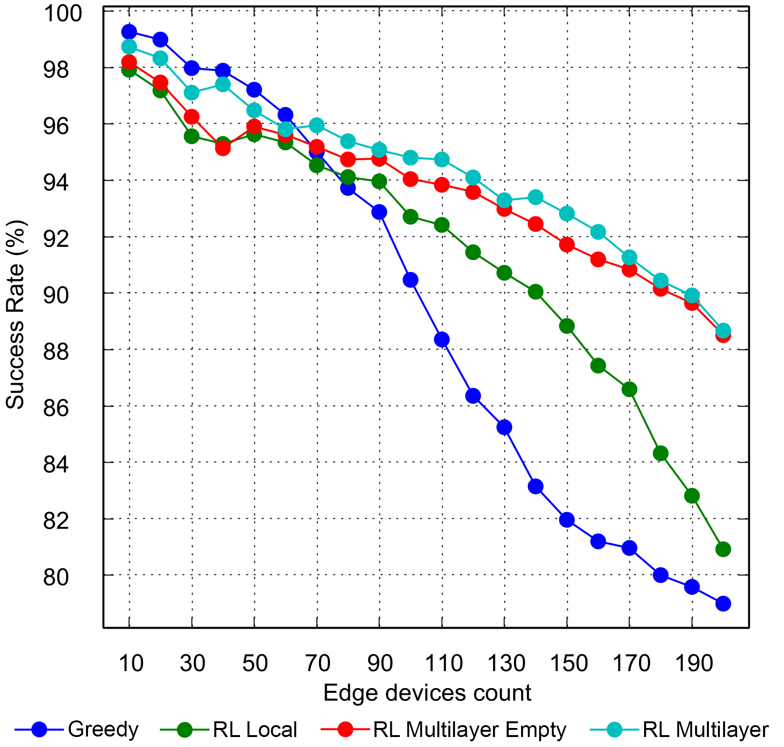
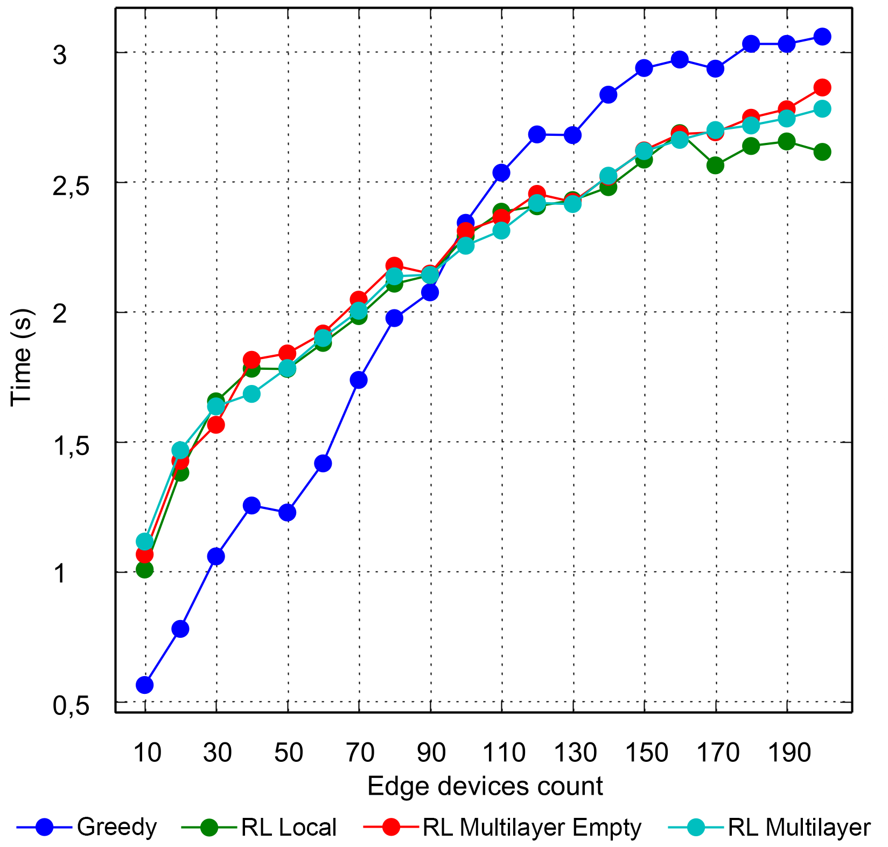
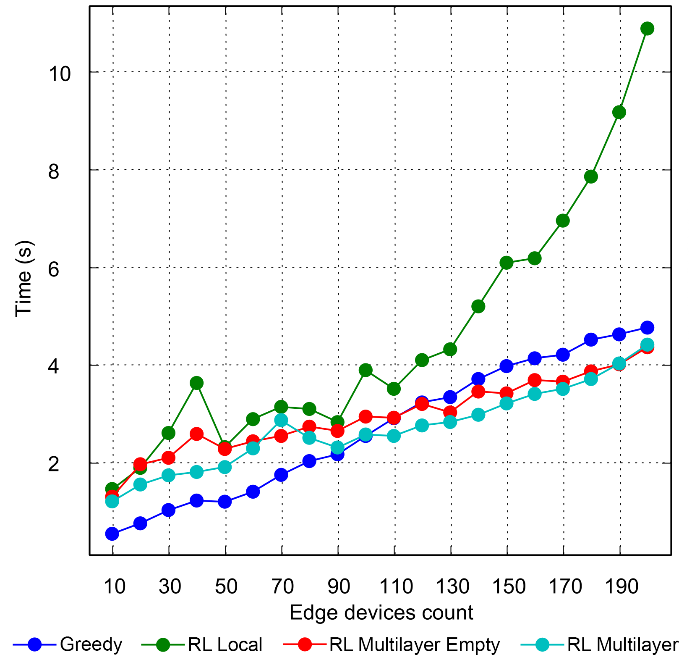
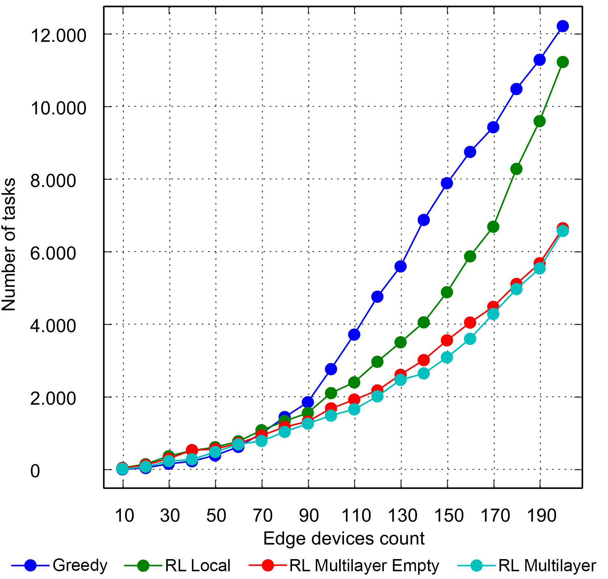
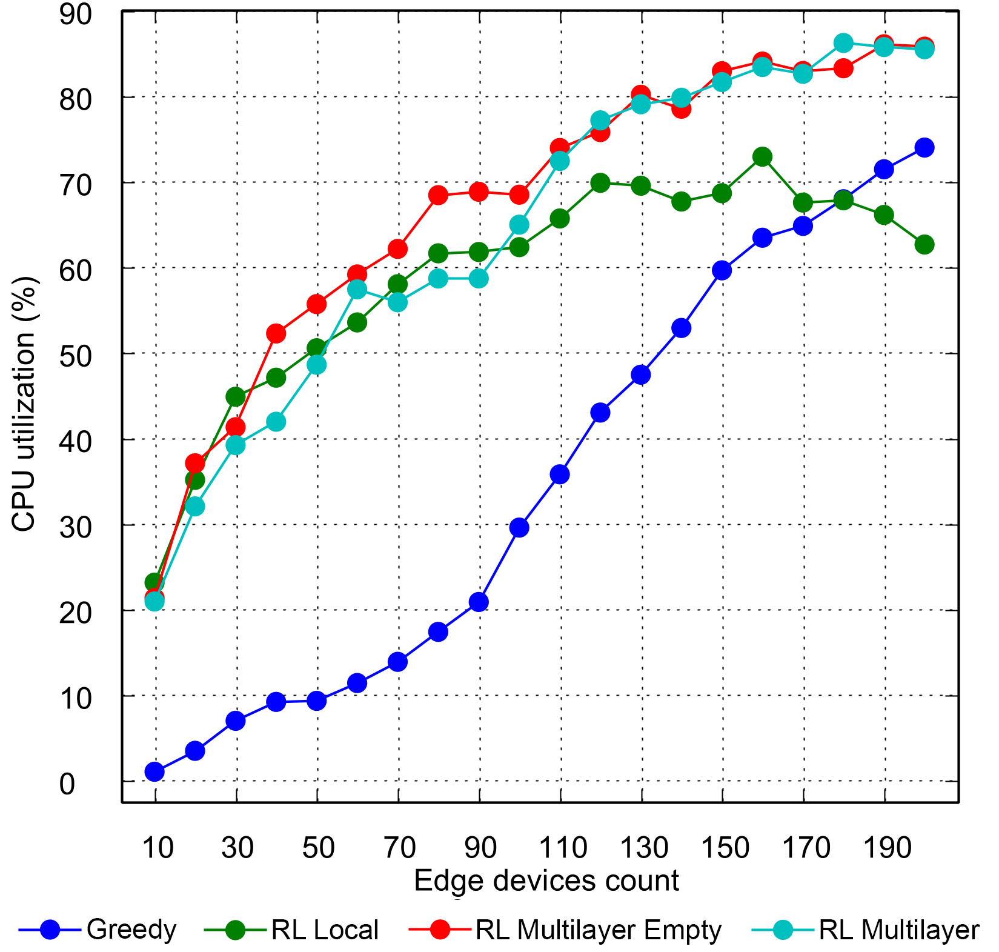
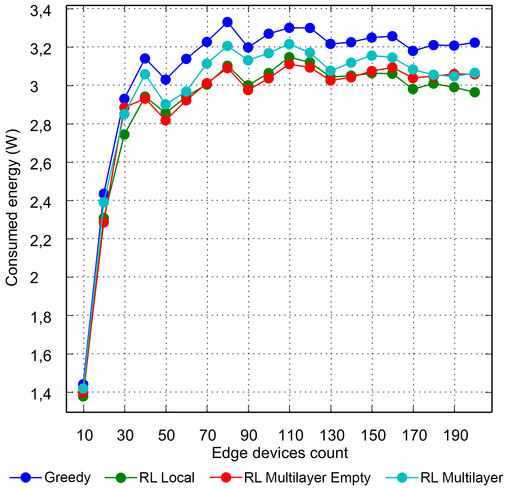
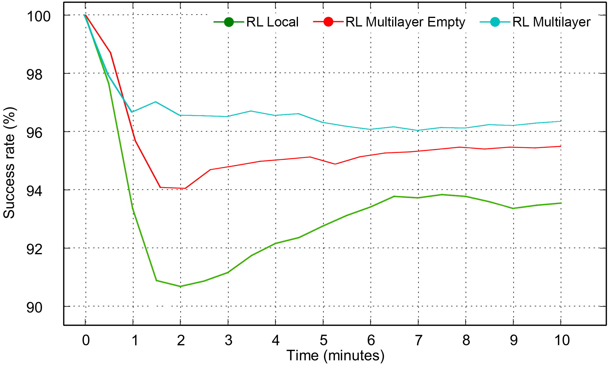
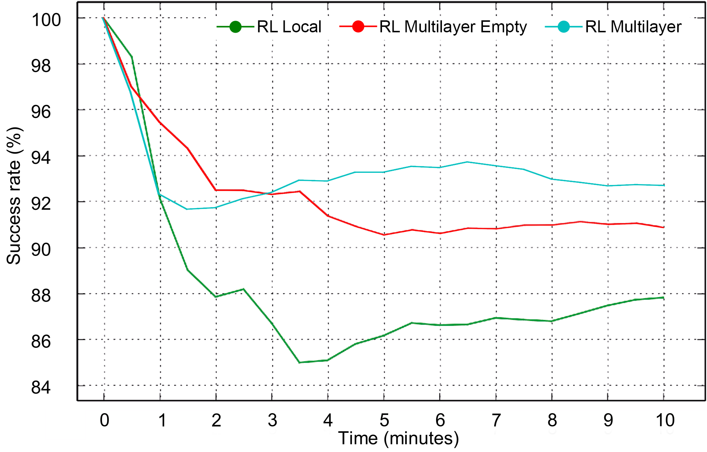

# ML-RL-simulations
A multi-layer guided reinforcement learning-based tasks offloading in edge computing - Simulations

# Table of contents
- [Metrics](#metrics)
- [Compared Methods](#compared-methods)
- [Preview of the simulations](#preview-of-the-simulations)
  - [Greedy algorithm](#greedy-algorithm)
  - [Local Reinforcement Learning algorithm](#local-reinforcement-learning-algorithm)
  - [Multi-Layer Reinforcement Learning algorithm](#multi-layer-reinforcement-learning-algorithm)
- [Experimental Results and Analysis](#experimental-results-and-analysis)

# Metrics
In order to compare the performance of each algorithm we have defined the following benchmark metrics:

* **Task Success Rate:** The percentage of the tasks that finish their execution over the total. A task is not considered to complete its execution correctly if its execution time exceeds its deadline or if the offloading process fails. This metric is one of the most important for the evaluation process.
* **Average Total Time:** The total time required to complete successfully a task, which includes the execution time and the time to send the task to the processing node. This metric is especially useful for comparing the latency incurred by each algorithm.
* **Average Real Total Time:** Same as **Average Total Time** but also considering the time wasted on tasks that were not executed successfully.
* **Failed tasks due to latency:** The number of tasks that have failed because their execution time exceeds their maximum allowed latency.
* **Average CPU Usage per device:** Average CPU usage of a device. Useful to determine how much the computational resources of the devices are used.
* **Average Energy Consumption per Device:** Average power consumption of one device. 

# Compared Methods
We have implemented in the simulator the three algorithms proposed in this article to evaluate their performance. The greedy solution will serve as a reference for comparison with the single-layer reinforcement learning algorithm and our proposed multi-layer guided RL.
The parameters used by the heuristic of the greedy algorithm are:

| Greedy Algorithm Parameter | Value |
|-------------------------------------|----------------|
| Nearest device weighing α    | 1.1            |
| Edge server weighing β        | 1.5            |
| Cloud weighing γ             | 1.8            |
| CPU trade-off δ              | 20             |

On the other hand, we designed three methods based on the implementations of the reinforcement learning solutions explained in previous sections.
The first one is the basic implementation of a reinforcement learning algorithm that runs locally on each device without external knowledge, in the tests we will denote it as *Local RL*.

The second and third methods are the same implementation of the multi-layer RL algorithm but with different initial conditions. The *RL Multilayer Empty* version starts each simulation with all Q-Tables (knowledge) of the devices completely empty, while *RL Multilayer}* version uses on the fog servers the Q-Table resulting from the previous simulations, with the same configuration, to simulate the behaviour of a system that starts with knowledge to improve initial performance.
The parameters used by both methods are summarised in the following table:

| Parameter / RL Algorithm         | Single | Multi |
|----------------------------------|--------|-------|
| Learning rate α          | 0.6    | 0.6   |
| Latency-Energy Trade-off β | 0.003  | 0.003 |
| Discount factor γ         | 0.3    | 0.3   |
| Failure penalty δ         | 1000   | 1000  |
| Average CPU refresh rate         | 60s    | 60s   |
| Query reward factor ρ      | -      | 0.2   |
| Query use penalty ω      | -      | 10    |
| Initial Q-Value                  | 200    | 200   |
| Initial Query Q-Value            | -      | 10    |

# Preview of the simulations
Examples of some simulations performed for different number of devices and algorithms.

## Greedy algorithm
Example of greedy algorithm with 160 devices and random mobility.

## Local Reinforcement Learning algorithm
Example of local knowledge RL algorithm with 160 devices and random mobility.

## Multi-Layer Reinforcement Learning algorithm
Example of the multi-layer extension of the RL algorithm with 160 devices and random mobility.

# Experimental Results and Analysis

Each of the figures represents the metrics that were defined to make the comparison between algorithms from a scenario with 10 devices up to 200 and the value will be the average obtained by repeating the same simulation 10 times.

| Tasks Success Rate | Average Total Time | Average Real Total Time | 
|---|---|---|
|  |  |  |
| One of the most critical results is the success rate in task execution, since in practice this has the most negative impact on the end-user. | The average time required to complete a task for each algorithm and number of devices. | If we consider the time lost due to tasks that do not execute correctly because of latency, we can see the real impact of the algorithm's actions when deciding to do an unsuitable offloading. |

| Failed tasks due to latency | Average CPU Usage per device | Average Energy per Device |
|---|---|---|
|  |  |  |
| Multi-layer RL methods avoid the initial uncertainty by delegating the decision, thereby making better offloading decisions that reduce latency failures as can be seen in the picture. | Indicates the degree of utilization of resources, a proper distribution of tasks among the devices results in a high avg. CPU usage per device as resource utilisation is maximised.  In contrast, low CPU usage indicates that the algorithm is saturating a few devices while many others are idle. | Similarly, the performance of algorithms can be measured in terms of their energy consumption as this is one of the components of the optimization problem. |

The multi-layer method offers superior real-time performance and rate of convergence to single-layer even in the version that starts without initial knowledge as shown in the simulation examples in following figures. The single-layer method provides initially low performance that slowly converges to the best possible at the end of the simulation.
However, the multi-layer method quickly achieves the best success rate of the single-layer method, due to the offloading query, to slowly improve the success rate by itself.
In addition, the multi-layer method that starts from the Q-tables of the fog agents learned in previous simulations directly achieves the best result and maintains it throughout the simulation.

| Success Rate Evolution 70 devices | Success Rate Evolution 170 devices |
|---|---|
|  |  |
| Simulation data source:   [RL Local](Simulations/Simulation%208/simulation/iteration_27__Orchestration%20algorithm%3D%20RL_MULTILAYER_DISABLED%20-%20%20Architechitecture%3D%20ALL%20-%20%20number%20of%20edge%20devices%3D%2070_final.png)  [RL Multi Empty](Simulations/Simulation%208/simulation/iteration_47__Orchestration%20algorithm%3D%20RL_MULTILAYER_EMPTY%20-%20%20Architechitecture%3D%20ALL%20-%20%20number%20of%20edge%20devices%3D%2070_final.png)  [RL Multi](Simulations/Simulation%208/simulation/iteration_67__Orchestration%20algorithm%3D%20RL_MULTILAYER%20-%20%20Architechitecture%3D%20ALL%20-%20%20number%20of%20edge%20devices%3D%2070_final.png) | Simulation data source:  [RL Local](Simulations/Simulation%208/simulation/iteration_37__Orchestration%20algorithm%3D%20RL_MULTILAYER_DISABLED%20-%20%20Architechitecture%3D%20ALL%20-%20%20number%20of%20edge%20devices%3D%20170_final.png)  [RL Multi Empty](Simulations/Simulation%208/simulation/iteration_57__Orchestration%20algorithm%3D%20RL_MULTILAYER_EMPTY%20-%20%20Architechitecture%3D%20ALL%20-%20%20number%20of%20edge%20devices%3D%20170_final.png)  [RL Multi](Simulations/Simulation%208/simulation/iteration_77__Orchestration%20algorithm%3D%20RL_MULTILAYER%20-%20%20Architechitecture%3D%20ALL%20-%20%20number%20of%20edge%20devices%3D%20170_final.png) |

TODO
